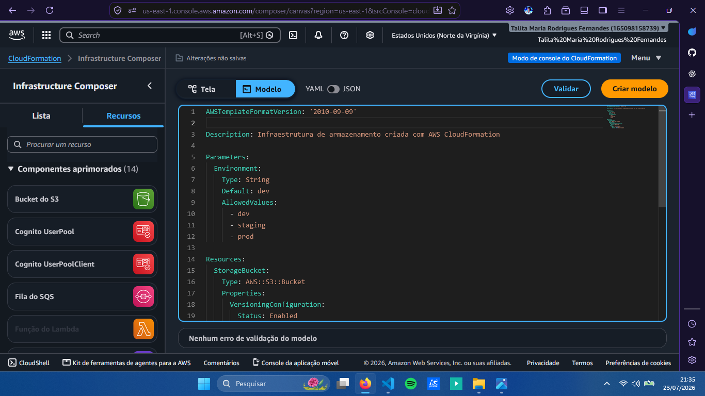
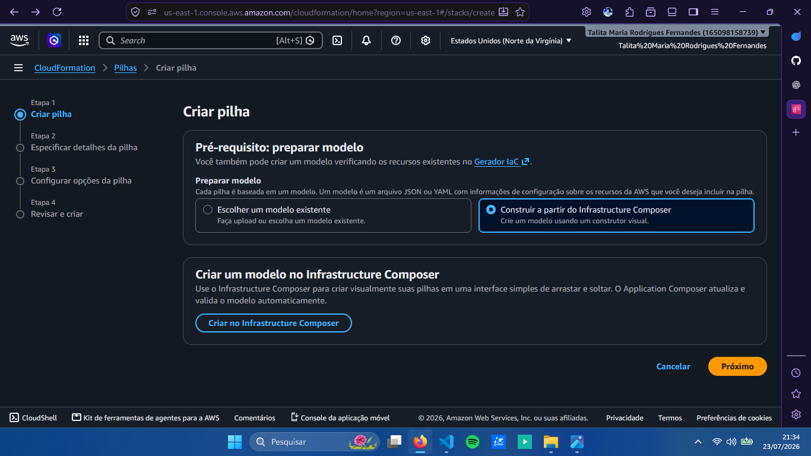
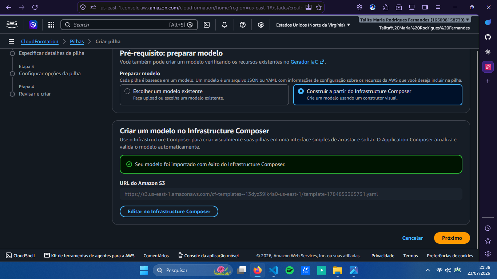
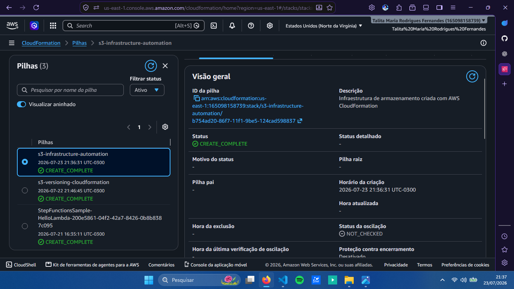
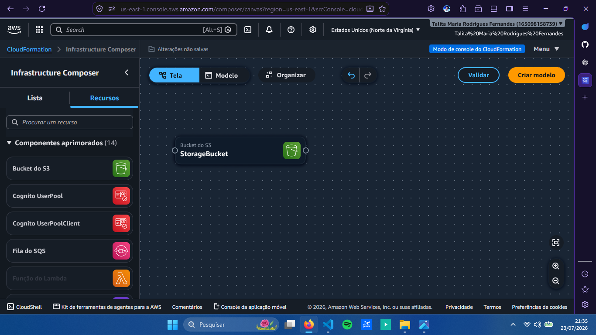

# ☁️ Automação de Infraestrutura com AWS CloudFormation

## 📖 Sobre o projeto

Este projeto apresenta uma prática de automação de infraestrutura utilizando o conceito de **Infrastructure as Code (IaC)** e o serviço **AWS CloudFormation**.

Foi desenvolvido um template em YAML para provisionar um bucket Amazon S3 com versionamento habilitado. O modelo foi utilizado no **AWS Infrastructure Composer**, permitindo visualizar a infraestrutura de forma mais clara antes de realizar sua implantação.

A prática demonstra como templates podem ser utilizados para criar infraestruturas padronizadas e replicáveis na AWS.

## 🛠️ Tecnologias e serviços utilizados

- AWS CloudFormation
- AWS Infrastructure Composer
- Amazon S3
- YAML

## 📄 Template utilizado

O template utilizado nesta prática está disponível no arquivo [`template.yaml`](template.yaml).

O modelo define a criação de um bucket S3 com versionamento habilitado:

## 🏗️ Utilização do Infrastructure Composer

O template foi utilizado no AWS Infrastructure Composer para visualizar a estrutura da infraestrutura antes da implantação.

## 🚀 Criação da infraestrutura

Após a configuração do modelo, a criação da infraestrutura foi confirmada através do AWS CloudFormation.

A pilha foi criada com sucesso e o recurso definido no template foi provisionado na AWS.

## ✅ Validação

Após a criação da pilha, o bucket S3 foi acessado para validar o recurso provisionado.

## 💡 Aprendizados

Esta prática permitiu compreender como a Infrastructure as Code pode ser utilizada para automatizar o provisionamento de recursos na AWS.

Também foi possível explorar o uso de templates YAML e do AWS Infrastructure Composer para criar, visualizar e gerenciar uma infraestrutura de forma padronizada e replicável.

---

Desenvolvido durante os estudos de Cloud Computing 🚀
